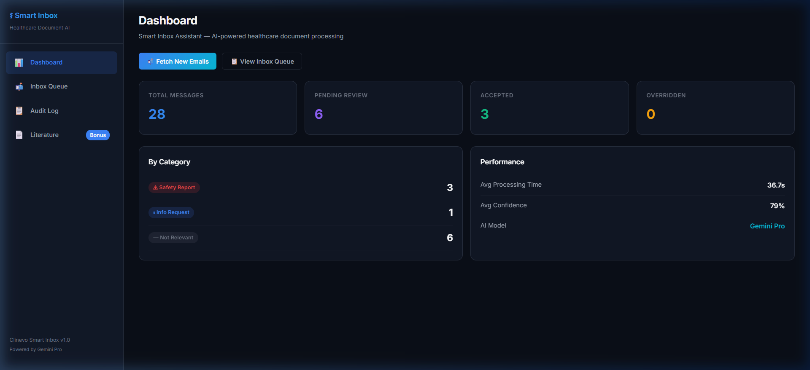
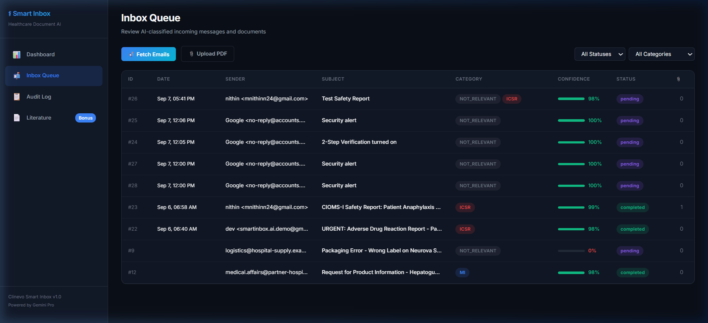
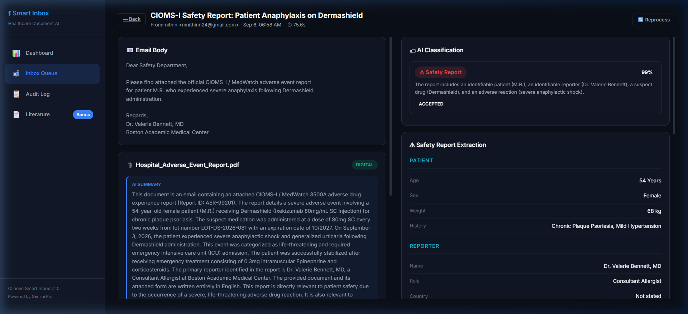
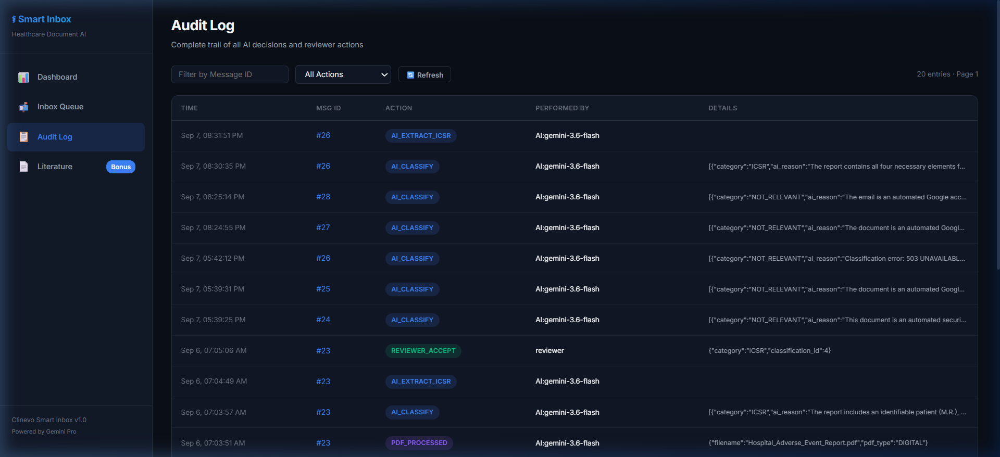
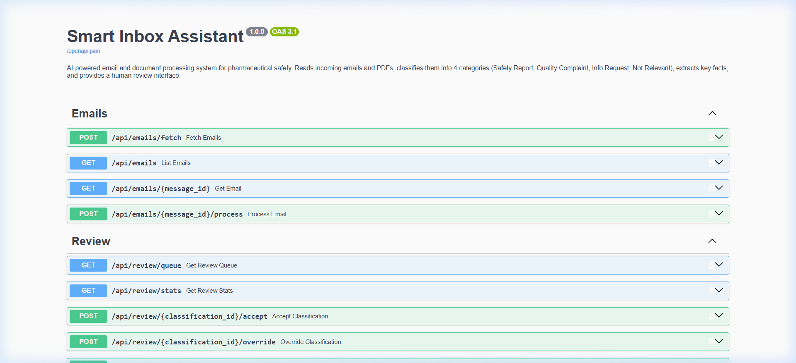

# 🏥 Smart Inbox Assistant for Healthcare

> AI-powered email triage and document processing for pharmaceutical safety — built for the **Clinevo Technologies** live project assignment.



---

## 📸 Screenshots

| Dashboard | Inbox Queue |
|:-:|:-:|
|  |  |

| Document Viewer (ICSR Extraction) | Audit Log |
|:-:|:-:|
|  |  |

**REST API (Swagger UI):**



---

## 🏗 Architecture

```
Angular 17 (Frontend)
       ↓
FastAPI Python Backend  ←→  MySQL Database
       ↓
Google Gemini Pro (AI)
       ↓
Gmail IMAP (Email Ingestion)
```

**Full Processing Pipeline:**
```
Gmail IMAP
  → Fetch unread emails + PDF attachments
  → Detect PDF type (Digital / Scanned-OCR / Article / Non-English)
  → Extract text (PyPDF2 / Gemini Vision OCR)
  → AI Classify into 4 categories (ICSR / PQC / MI / NOT_RELEVANT)
  → AI Extract structured facts (Patient, Drug, Reaction, Reporter)
  → Save all results + Audit Trail to MySQL
  → Human Reviewer UI (Accept / Override / Reject)
```

---

## 🚀 Quick Start

### Prerequisites
- Python 3.11+ (`python` or `py` command)
- Node.js 20.9+ & npm
- MySQL Server (local, port 3306)
- Gmail account with **App Password** (requires 2-Step Verification — NOT regular password)
- Google Gemini Pro API key ([get one free](https://aistudio.google.com/))

### 1. Database Setup
```bash
mysql -u root -p < database/schema.sql
```

### 2. Backend Setup
```bash
cd backend
copy .env.example .env
# Fill in your credentials in .env (see Environment Variables below)

pip install -r requirements.txt
python -m uvicorn app.main:app --host 0.0.0.0 --port 8000
```

### 3. Frontend Setup
```bash
cd frontend
npm install
npx @angular/cli@17 serve --port 4200
```

| Service | URL |
|:--------|:----|
| **Frontend App** | http://localhost:4200 |
| **Backend API** | http://localhost:8000 |
| **Swagger API Docs** | http://localhost:8000/docs |

---

## 📋 Environment Variables

Create a `.env` file in the `backend/` folder (copy from `.env.example`):

| Variable | Description | Example |
|----------|-------------|---------|
| `GMAIL_USER` | Gmail address for IMAP | `user@gmail.com` |
| `GMAIL_APP_PASSWORD` | 16-character App Password | `abcd efgh ijkl mnop` |
| `GEMINI_API_KEY` | Google Gemini Pro API key | `AIzaSy...` |
| `GEMINI_MODEL` | Model name | `gemini-2.0-flash` |
| `DB_HOST` | MySQL host | `127.0.0.1` |
| `DB_PORT` | MySQL port | `3306` |
| `DB_USER` | MySQL username | `root` |
| `DB_PASSWORD` | MySQL password | `your-password` |
| `DB_NAME` | MySQL database name | `smart_inbox` |

> ⚠️ **Never commit `.env` with real credentials.** The `.gitignore` already excludes it.

---

## 🏷 The Four Categories

| Category | Meaning | Key Signals |
|----------|---------|-------------|
| 🔴 **ICSR** — Safety Report | Patient had adverse reaction to a drug | Specific patient + reporter + drug + bad outcome — all 4 needed |
| 🔧 **PQC** — Quality Complaint | Physical defect in the product | Broken seal, wrong color, contamination, damaged packaging |
| ℹ️ **MI** — Info Request | Question about a product | Dosing questions, interactions — no adverse event |
| ⬜ **NOT_RELEVANT** | Everything else | Marketing, spam, admin emails |

---

## 🧪 Test Data

20+ synthetic documents in `test-data/` covering all required types:

| Type | Count | Description |
|:-----|:-----:|:------------|
| Safety Report emails (ICSR) | 5 | Varying detail levels, some incomplete |
| Quality Complaint emails (PQC) | 2 | Packaging errors, contamination |
| Info Request emails (MI) | 2 | Dosing questions |
| Irrelevant emails | 3 | Spam, Google security alerts |
| Normal digital PDFs | 5 | Filled AE report forms |
| Scanned/handwritten PDFs | 2 | OCR required |
| Published article PDFs | 5 | Multi-column, case extraction |
| Non-English PDFs | 2 | French & Spanish (auto-translated) |

---

## 📂 Project Structure

```
smart-inbox-assistant/
├── backend/                    # FastAPI Python backend
│   ├── app/
│   │   ├── main.py             # App entry point, CORS, router registration
│   │   ├── config.py           # Environment variable config
│   │   ├── database.py         # Async MySQL connection pool
│   │   ├── models/             # Pydantic schemas (email, classification, review)
│   │   ├── services/
│   │   │   ├── ai_service.py   # Google Gemini integration (classify + extract)
│   │   │   ├── email_service.py# Gmail IMAP fetch
│   │   │   ├── pdf_service.py  # PDF type detection + text extraction + OCR
│   │   │   ├── pipeline.py     # End-to-end processing orchestrator
│   │   │   └── queue_service.py# Async processing queue
│   │   ├── routers/            # API endpoints (emails, review, audit, literature)
│   │   └── utils/              # AI prompts, helper functions
│   ├── requirements.txt
│   └── .env.example
├── frontend/                   # Angular 17 frontend
│   └── src/app/
│       ├── components/         # Dashboard, Inbox Queue, Doc Viewer, Audit, Literature
│       ├── services/           # HTTP API client
│       └── models/             # TypeScript interfaces
├── database/
│   └── schema.sql              # MySQL schema (9 tables)
├── test-data/                  # Synthetic test documents + load script
├── sample-outputs/             # Extracted JSON examples (per Clinevo Section 7.5)
└── docs/
    ├── architecture.md         # Full architecture write-up (2–5 pages)
    └── screenshots/            # UI screenshots
```

---

## ⚠️ Tech Stack Deviations

| Assignment Suggests | We Used | Justification |
|:---|:---|:---|
| Spring Boot (Java) | FastAPI (Python) | Python is the natural choice for AI/NLP work; direct access to Google Gemini SDK, PyPDF2, and langdetect. FastAPI eliminates the Java↔Python bridge. |
| Oracle PL/SQL | MySQL | Standard SQL used throughout; schema portable to Oracle with minimal changes. |
| Separate Python AI microservice | Integrated in FastAPI | Single-backend simplifies deployment and removes the REST/gRPC bridge complexity. |

---

## 📊 Assignment Scoring Coverage

| Area | Weight | Status |
|:-----|:------:|:------:|
| Core functionality (email/PDF intake, all 4 PDF types, classification, extraction) | 30% | ✅ |
| AI/LLM quality (structured prompts, confidence scoring, "Not stated" for unknowns) | 25% | ✅ |
| Code & architecture (clean separation, async pipeline, API design) | 20% | ✅ |
| Domain accuracy (4 categories correctly identified per Section 2 rules) | 10% | ✅ |
| Traceability (every fact links to source, full timestamped audit log) | 10% | ✅ |
| Documentation (README + architecture write-up) | 5% | ✅ |
| **Bonus: Literature Screening (Section 4)** | **+30%** | ✅ |

---

## 🔒 Data Privacy Note

All test data is **100% synthetic** — no real patient, doctor, or company information was used at any point. The system is designed for demonstration and evaluation purposes only.

---

*Clinevo Technologies Pvt. Ltd. — Candidate evaluation project.*

